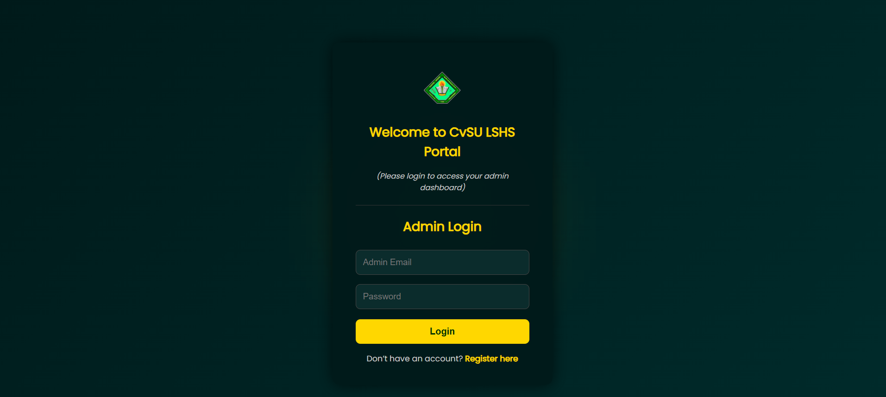
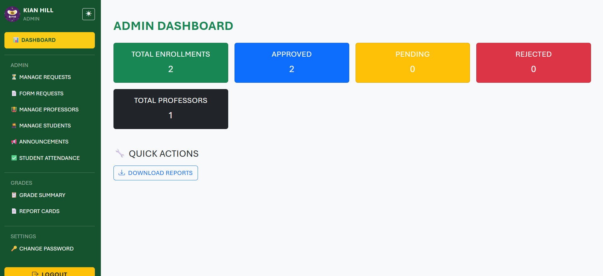
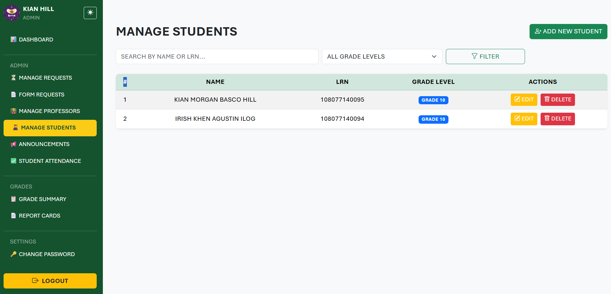
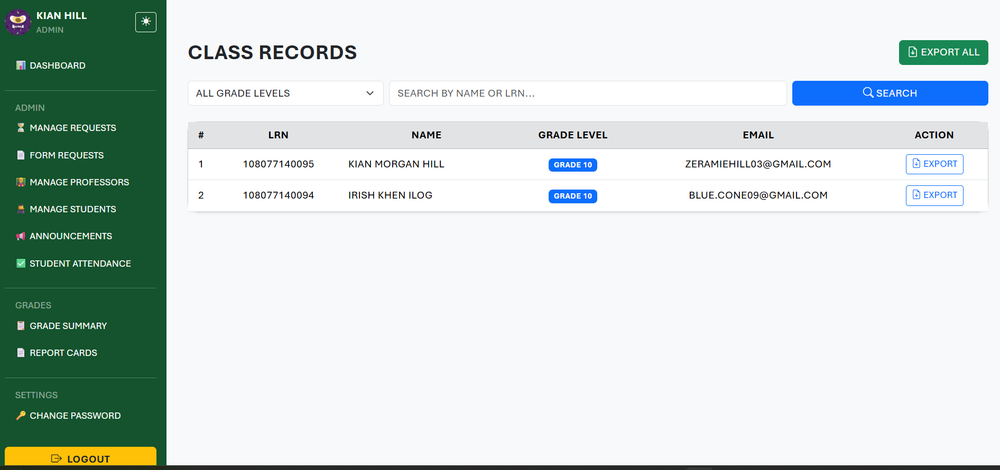

# 🏫 LSHS: Online Management Information System

A **web-based information system** developed for **Lipa Science High School (LSHS)** to streamline academic and administrative processes such as student enrollment, attendance tracking, grading, and report generation.

---

## 📋 Table of Contents
- [About the Project](#-about-the-project)
- [Features](#-features)
- [Tech Stack](#-tech-stack)
- [Installation](#-installation)
- [Usage](#-usage)
- [Folder Structure](#-folder-structure)
- [Screenshots](#-screenshots)
- [Future Improvements](#-future-improvements)
- [License](#-license)
- [Author](#-author)

---

## 🧩 About the Project
The **LSHS Online Management Information System (OMIS)** is designed to automate and simplify the school’s record management tasks, reducing manual work and improving data accuracy and accessibility for both faculty and students.

This project was developed as a **capstone system** under the **Computer Studies Department**.

---

## ✨ Features
✅ **User Roles & Authentication**
- Separate dashboards for Admin, Teachers, and Students  
- Secure login and access management  

✅ **Student Information Management**
- Create, update, and view student records  
- Upload and manage student documents  

✅ **Enrollment System**
- Automated student registration and section assignment  
- Yearly enrollment records tracking  

✅ **Grading & Evaluation**
- Faculty-grade encoding and computation  
- Automated report card and ranking generation  

✅ **Attendance Monitoring**
- Class attendance recording and report generation  

✅ **Reports & Data Export**
- Generate printable reports and Excel exports  
- Custom date, section, and grade-level filters  

---

## 🛠️ Tech Stack

| Category | Technology |
|-----------|-------------|
| **Frontend** | HTML, CSS, JavaScript, Bootstrap |
| **Backend** | PHP (Laravel / Core PHP) |
| **Database** | MySQL (via XAMPP) |
| **Server** | Apache (XAMPP) |
| **Version Control** | Git & GitHub |

---

## ⚙️ Installation

### Prerequisites
Make sure you have the following installed:
- [XAMPP](https://www.apachefriends.org/download.html)
- [Git](https://git-scm.com/downloads)
- Web browser (Chrome, Edge, Firefox)

### Steps
1. **Clone this repository**
   ```bash
   git clone https://github.com/Godcalyx/Management-Information-System.git

---

## 🖼️ Screenshots

### 🔐 Login Page


### 🏠 Admin Dashboard


### 👩‍🎓 Student Management


### 🧾 Report Card

