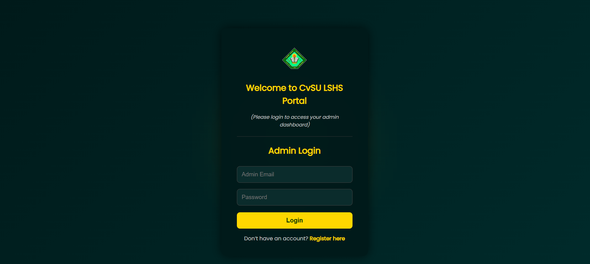
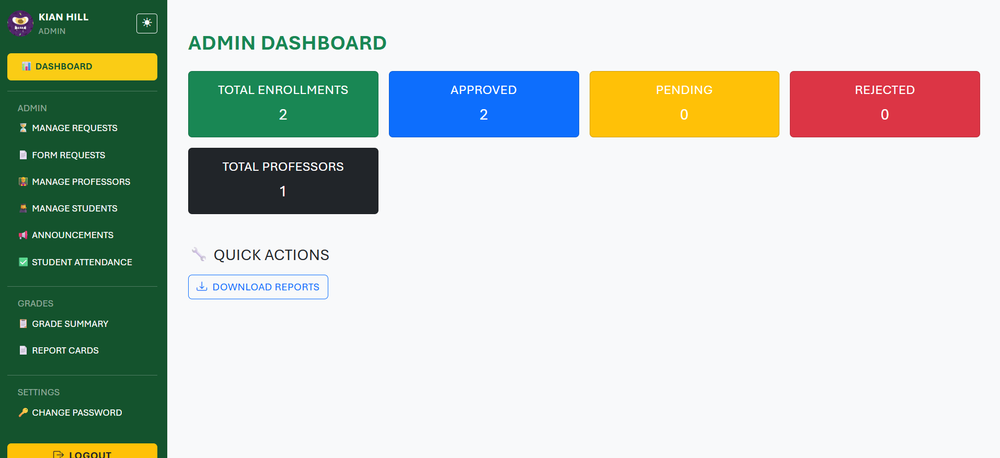
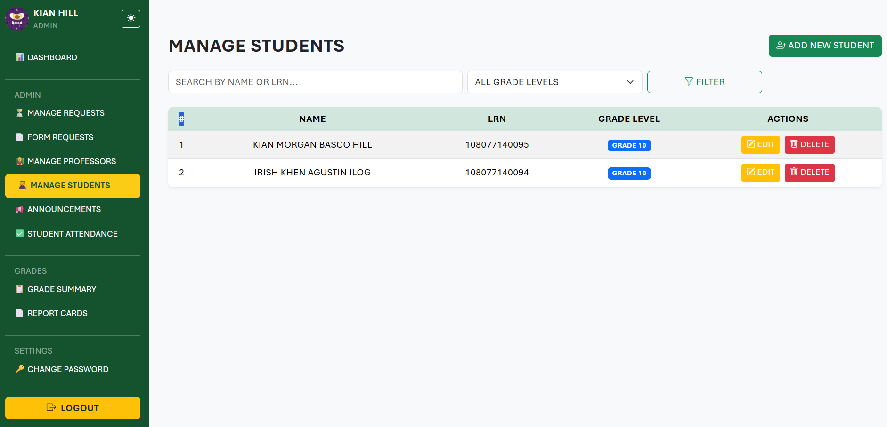
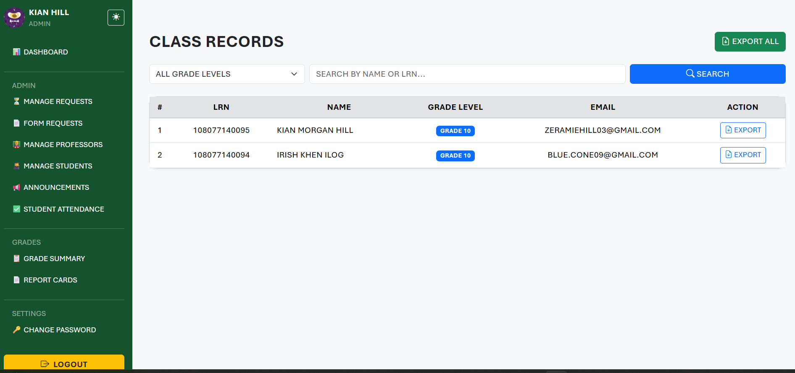

# LSHS: Online Management Information System

[](https://laravel.com)
[](https://www.php.net/)
[](https://www.mysql.com/)
[](https://github.com/Godcalyx/Management-Information-System)

A web-based information system for Laboratory Science High School (LSHS) focused on enrollment, grading, attendance, and academic records management.

## About

The LSHS Online Management Information System (OMIS) is a capstone project built to reduce manual record handling and improve access to school data for administrators, professors, students, and superadmins.

## Features

- Role-based access for admin, professor, student, and superadmin users
- Student enrollment and approval workflow
- Grade encoding, approval, and report generation
- Attendance and announcement management
- Form and report-card request handling
- PDF and Excel exports for academic records

## Tech Stack

| Category | Technology |
| --- | --- |
| Frontend | HTML, CSS, JavaScript, Bootstrap |
| Backend | PHP, Laravel |
| Database | MySQL |
| Local Server | XAMPP / Apache |
| Version Control | Git, GitHub |

## Installation

### Prerequisites

- [XAMPP](https://www.apachefriends.org/download.html)
- [Composer](https://getcomposer.org/)
- [Git](https://git-scm.com/downloads)
- A modern web browser

### Setup

1. Clone the repository:

```bash
git clone https://github.com/Godcalyx/Management-Information-System.git
cd LSHS-OMIS
```

2. Install dependencies:

```bash
composer install
```

3. Create and configure the environment file:

```bash
copy .env.example .env
php artisan key:generate
```

4. Update `.env` with your database credentials, then run:

```bash
php artisan migrate
```

5. Start the local server:

```bash
php artisan serve
```

## Screenshots

### Login Page


### Admin Dashboard


### Student Management


### Report Card

